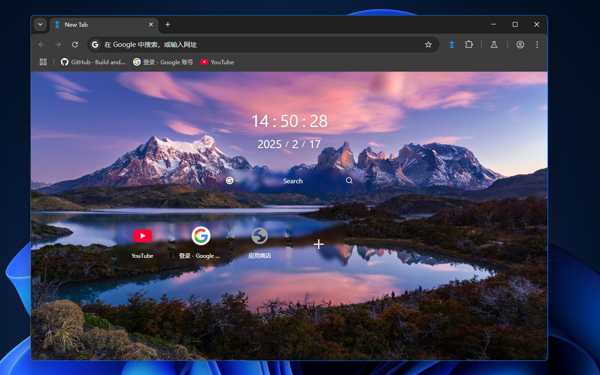
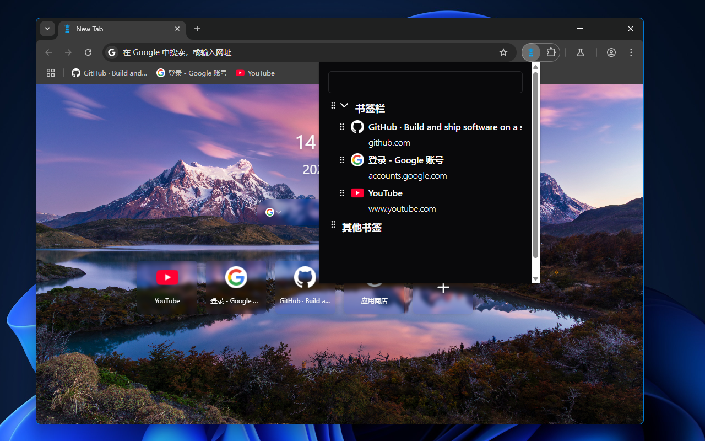

# Tab 管家 (Tab Butler)

A Google Chrome tab extension with bookmark search and management features.

You can customize search engines and search parameters according to user preferences.

[中文版](./README.md) | English

## Content Introduction

1. Home page background and fixed commonly used websites.
   
2. Bookmark directory search
   
3. Save any website to bookmarks
   
4. Theme color background image/video settings
   
5. Search engine and additional search parameter handling
   

## Usage Instructions

### Download from Chrome Web Store

### Manually Package and Import

1. Get the code from the repository

```bash
git clone xxx
```

2. Install Node.js (18) and the package manager pnpm according to the runtime requirements
3. Install dependencies and build

```bash
pnpm i

pnpm run build
```

## Content Introduction

### Apps

- `pages`: Multi-page application built with Vite, React, and TypeScript
- `chrome-extension`: Background script for the browser extension built with Vite and TypeScript

### Packages

- `@repo/eslint-config`: ESLint configuration
- `@repo/hmr`: Vite plugin for hot module replacement in browser extensions
- `@repo/tailwind-config`: Tailwind configuration used in the project
- `@repo/typescript-config`: Extended tsconfig templates
- `@repo/ui`: Component library built with Shadcn UI
- `@repo/vite`: Vite configuration

## Notes

### Advanced Search Parameter Configuration Documentation

1. Google: https://www.google.com/advanced_search?q=

2. Bing: https://support.microsoft.com/en-us/topic/advanced-search-options-b92e25f1-0085-4271-bdf9-14aaea720930

3. Baidu: Baidu homepage > Settings > Advanced Search

For example, to exclude search results containing csdn or CSDN:

Google: ` -csdn -CSDN` (note the leading space)

Bing: ` -site:csdn.net` (note the leading space)

Baidu: ` -(csdn | CSDN)` (note the leading space)

### Adding a Search Engine

For example, to add GitHub:

1. Open GitHub and search for "chrome" to get the URL
   `https://github.com/search?q=chrome&type=repositories`

2. Remove unnecessary parameters and keep the base search URL
   `https://github.com/search?q=`

Common search engines:

| Name   | Search URL                       |
| :----- | :------------------------------- |
| Google | https://www.google.com/search?q= |
| Bing   | https://bing.com/search?q=       |
| Baidu  | https://www.baidu.com/s?wd=      |
| GitHub | https://github.com/search?q=     |
| npm    | https://www.npmjs.com/search?q=  |
